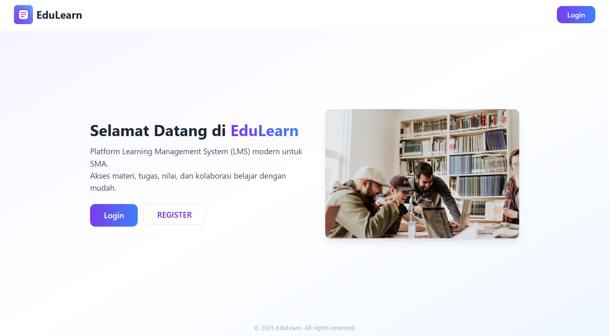
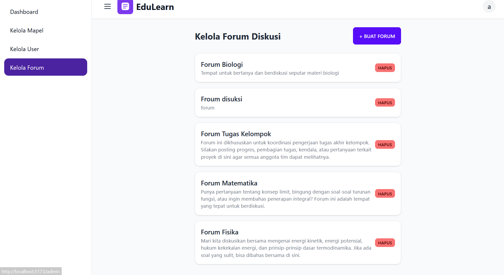
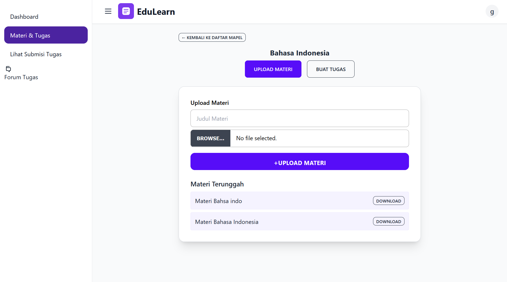

# Proyek Learning Management System (LMS) - SMA Plus YPHB

Proyek ini dibuat untuk memenuhi tugas mata kuliah Rekayasa Perangkat Lunak (RPL).

https://project-rpl-5-pendidikan.vercel.app/

Akun untuk login:
- Role Admin:
  admin@gmail.com; pw:
  admin
  
- Role Guru:
  guru@gmail.com; pw:
  guru
  
- Role Siswa:
  siswa@gmail.com; pw:
  siswa

## Deskripsi Proyek

Aplikasi ini adalah sebuah Learning Management System (LMS) berbasis web yang dirancang untuk SMA Plus YPHB. Tujuannya adalah untuk menggantikan proses pembelajaran yang masih manual (menggunakan WhatsApp dan dokumen cetak) dengan platform digital yang lebih efisien dan terorganisir. Dengan LMS ini, guru dapat mengelola materi dan tugas secara terstruktur, sementara siswa dapat dengan mudah mengakses konten pembelajaran dan mengumpulkan tugas secara daring.

## Identitas Kelompok

Proyek ini dikerjakan oleh **Kelompok 5 P3**:

| Nama                          | NIM         |
| ----------------------------- | ----------- |
| Hamzah Hudzaifah              | G6401231011 |
| Naufal Ghifari Afdhala        | G6401231029 |
| Muhammad Faqih                | G6401231081 |
| Muhammad Chalied Al Walid     | G6401231114 |
| Davina Lydia Alessandra Mamesah | G6401231148 |

## Arsitektur Sistem

Sistem ini dibangun menggunakan arsitektur modern dengan pemisahan antara Frontend dan Backend.

 

* **Frontend (Aplikasi Klien)**:
    * **Framework:** React.js dengan Vite sebagai build tool.
    * **Styling:** Menggunakan TailwindCSS dan DaisyUI untuk desain antarmuka yang responsif dan konsisten.
    * **Logika:** Mengelola semua interaksi pengguna, navigasi halaman (dengan React Router), dan komunikasi dengan backend.

* **Backend as a Service (BaaS)**:
    * **Platform:** Supabase.
    * **Database:** Menggunakan database PostgreSQL yang disediakan oleh Supabase untuk menyimpan semua data (pengguna, mata pelajaran, tugas, materi, forum, dll).
    * **Penyimpanan (Storage):** Supabase Storage untuk mengelola unggahan file seperti dokumen materi dan tugas.
    * **API:** Interaksi antara frontend dan backend dilakukan melalui API RESTful yang secara otomatis dibuat oleh Supabase.

## Tampilan Fitur

Berikut adalah beberapa tangkapan layar dari fitur-fitur utama aplikasi.

### Halaman Login & Dasbor
*Tampilan untuk login dan dasbor utama untuk setiap peran (Admin, Guru, Siswa).*
 

### Fitur Admin
*Admin dapat mengelola data master seperti Pengguna dan Mata Pelajaran (Mapel).*
 

### Fitur Guru
*Guru dapat mengunggah materi, membuat tugas, dan memberikan penilaian.*
 

### Fitur Siswa
*Siswa dapat mengakses materi, melihat daftar tugas, dan mengunggah jawaban.*
 

### Fitur Forum Diskusi
*Forum diskusi berjenjang (nested) memungkinkan interaksi yang terstruktur antara pengguna.*
 


## Panduan Penggunaan Lokal

Untuk menjalankan proyek ini di lingkungan lokal, ikuti langkah-langkah berikut:

**1. Clone Repositori**
```bash
git clone [https://github.com/nghifaria/project-rpl-5-pendidikan.git](https://github.com/nghifaria/project-rpl-5-pendidikan.git)
cd project-rpl-5-pendidikan
